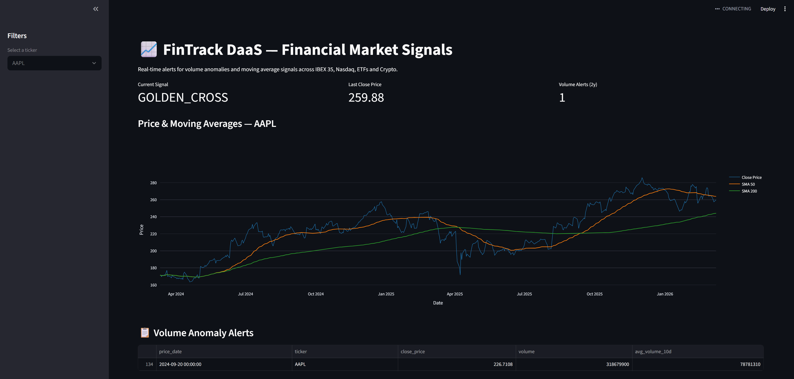

[](https://github.com/SantiagoBorao/fintrack-daas/actions)

🚀 **[Live Demo](https://santiagoborao-fintrack-daas.streamlit.app)**

# FinTrack — Volume Anomaly Detection Pipeline

I'm a computer engineer with a deep interest in both data engineering 
and financial markets. I'm currently studying technical 
analysis and professional trading, and I built this project because I 
wanted to understand how institutional investors detect unusual market 
activity and whether I could replicate that logic with open source tools.



## What it does

A batch data pipeline that monitors 50 assets across IBEX 35, Nasdaq, 
ETFs and Crypto. Every time you run it, it downloads 2 years of market 
data, stores it in BigQuery and calculates three signals that professional 
traders use daily:

- **SMA 50 / SMA 200 crossovers** — whether an asset is in a structural 
  uptrend or downtrend
- **Golden Cross / Death Cross detection** — one of the most watched 
  signals in technical analysis
- **Volume anomaly flags** — days where trading volume exceeds 300% of 
  the 10-day average, which often precede or confirm major price moves

For example, the picture above shows that on September 20, 2024, the pipeline flagged Apple with a 300%+ volume 
anomaly. That was iPhone 16 launch day. 318M shares traded against a 
78M daily average.

You can change the period or the assets to monitor in the `collector.py` file.

## Architecture


Yahoo Finance → Python → BigQuery (Raw) → dbt → Streamlit

## Why these tools

I chose **BigQuery** over a local database because I wanted the pipeline 
to be production-ready from day one. The free tier handles this project's ~30MB easily, and 
switching to Snowflake would only require changing a dbt profile.

I used **dbt** to make work separately on raw data and the business logic as they should never live in 
the same place. The staging layer handles cleaning, the mart layer handles 
calculations. This also is beneficial in case of Yahoo Finance changing anything in the information requested as it would only be necessary to change one file only.

**Streamlit** because it's an easy way to create a fast webpage without having to deal with any frontend developing.

## Project structure

Three independent components that can be modified or replaced without 
touching the others.

`collector/` extracts data from Yahoo Finance and loads it raw into 
BigQuery. There are no transformations nor business logic, it's just the data as it arrives.

`fintrack_transforms/` is the dbt project. The staging layer renames and 
cleans columns. The mart layer runs the SQL Window Functions that calculate 
moving averages and flag anomalies.

`app/` is the Streamlit dashboard that reads from the mart layer and 
renders everything interactively.

## How to run it

### Prerequisites
- Python 3.9+
- Google Cloud account (only free tier needed)
- Service account JSON key with BigQuery Data Editor and Job User roles

### Setup
```bash
git clone https://github.com/SantiagoBorao/fintrack-daas.git
cd fintrack-daas
python -m venv venv
venv\Scripts\activate
pip install -r requirements.txt
```

Place your `gcloud-key.json` in the root folder. It's in `.gitignore` already so you never commit your credentials.

### Run
```bash
# Download and load data
python collector/collector.py

# Transform
cd fintrack_transforms
dbt run

# Dashboard
streamlit run app/app.py
```

## What I might add in the future (open to hear your thoughts too 😉)

- Airflow or Prefect to schedule the collector daily instead of running 
  it manually
- dbt tests for data quality
- Email or Slack alerts when a volume anomaly is detected, so you don't 
  have to open the dashboard to find out
- Incremental dbt models so each run only processes new data instead of 
  the full history
- GitHub Actions to run dbt test on every push

## Author

**Santiago Borao** — Data Engineer | Data Automation & Financial Markets

[Santiagoborao.com](https://santiagoborao.com) · [LinkedIn](https://www.linkedin.com/in/santiagoborao/) · [GitHub](https://github.com/SantiagoBorao)
